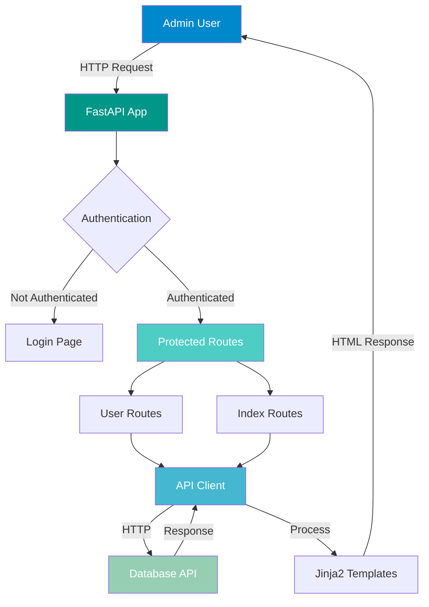
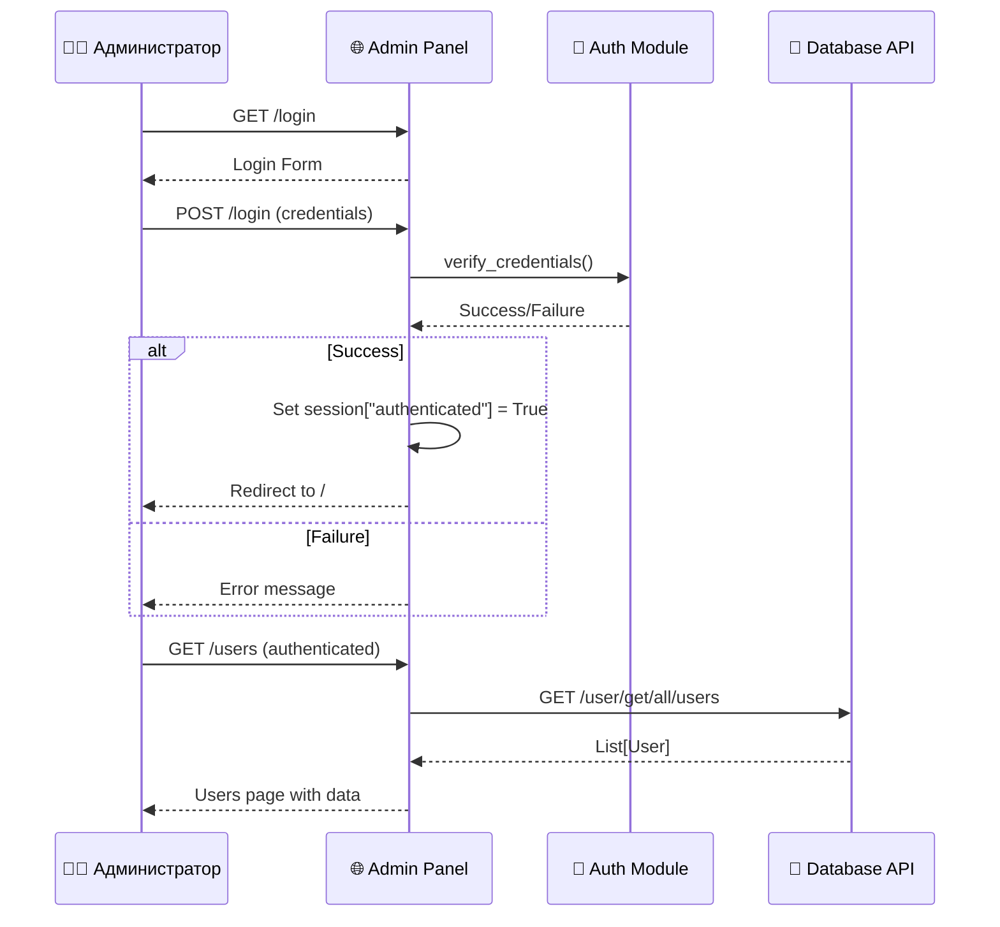
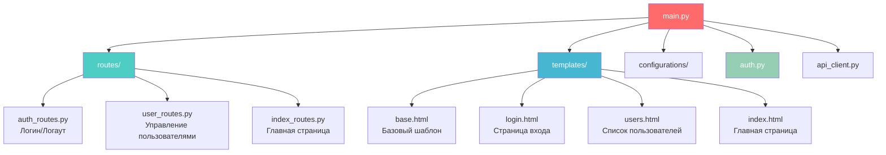
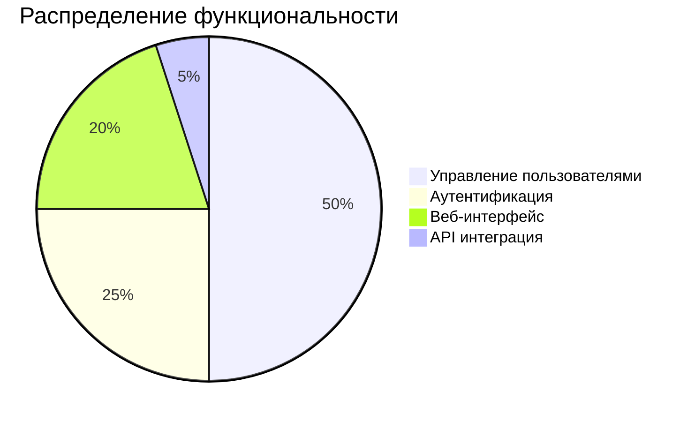

# 👨‍💼 AdminPanel Service - Веб-панель администратора

<div align="center">


**Веб-интерфейс для управления пользователями и системой**

[📖 Документация](#документация) • [🚀 Быстрый старт](#быстрый-старт) • [🔐 Аутентификация](#аутентификация)

</div>

---

## 📋 Содержание

- [Описание](#описание)
- [Архитектура](#архитектура)
- [Функциональность](#функциональность)
- [Быстрый старт](#быстрый-старт)
- [API Endpoints](#api-endpoints)
- [Конфигурация](#конфигурация)
- [Разработка](#разработка)

---

## 🎯 Описание

AdminPanel Service — это веб-приложение на базе **FastAPI** с использованием **Jinja2** шаблонов. Сервис предоставляет администраторам системы удобный интерфейс для управления пользователями и мониторинга системы.

### Основные возможности

- ✅ Безопасная аутентификация с сессиями
- ✅ Управление пользователями (просмотр, блокировка/разблокировка)
- ✅ Современный веб-интерфейс
- ✅ Интеграция с Database API
- ✅ Валидация данных
- ✅ Обработка ошибок

---

## 🏗️ Архитектура

### Схема работы панели



### Поток аутентификации



### Структура модулей



---

## ⚙️ Функциональность

### Основные страницы

| Страница | URL | Описание | Требуется авторизация |
|----------|-----|----------|----------------------|
| Главная | `/` | Дашборд системы | ✅ Да |
| Вход | `/login` | Страница аутентификации | ❌ Нет |
| Пользователи | `/users` | Управление пользователями | ✅ Да |
| Выход | `/logout` | Выход из системы | ✅ Да |

### Функции управления пользователями

- **Просмотр списка** — таблица со всеми пользователями
- **Блокировка/разблокировка** — изменение статуса `active`
- **Информация о пользователе:**
  - Telegram User ID
  - Username (tag)
  - Количество устройств
  - Статус (активен/заблокирован)
  - Дата регистрации

---

## 🚀 Быстрый старт

### Предварительные требования

- Python 3.10+
- Запущенный Database API Service
- Учетные данные администратора

### Установка

1. **Установите зависимости:**
```bash
cd AdminPanel
pip install -r requirements.txt
```

2. **Настройте переменные окружения:**

Создайте файл `.env` или установите переменные окружения:

```env
DATABASE_API_URL=http://localhost:8000
AUTH_USERNAME=admin
AUTH_PASSWORD=your_secure_password
SECRET_KEY=your_secret_key_for_sessions
```

3. **Запустите сервис:**
```bash
python main.py
```

Сервис будет доступен по адресу: http://localhost:8001

### Запуск через Docker

```bash
# Из корневой директории проекта
docker compose up adminpanel -d
```

---

## 🔐 Аутентификация

### Механизм аутентификации

AdminPanel использует **сессионную аутентификацию** на основе cookies.

### Настройка учетных данных

Учетные данные администратора настраиваются через переменные окружения:

```env
AUTH_USERNAME=admin
AUTH_PASSWORD=secure_password_123
```

⚠️ **Важно:** В продакшене используйте сильные пароли и храните их в безопасном месте!

### Защита маршрутов

Маршруты защищены декоратором `@require_auth`:

```python
@router.get("/users")
@require_auth
async def users_page(request: Request):
    # Защищенный код
    pass
```

### Процесс входа

1. Пользователь переходит на `/login`
2. Вводит username и password
3. Система проверяет учетные данные
4. При успехе создается сессия
5. Пользователь перенаправляется на главную страницу

---

## 📡 API Endpoints

### Внутренние маршруты (FastAPI)

| Метод | Путь | Описание | Авторизация |
|-------|------|----------|-------------|
| GET | `/` | Главная страница | ✅ |
| GET | `/login` | Страница входа | ❌ |
| POST | `/login` | Обработка входа | ❌ |
| GET | `/logout` | Выход из системы | ✅ |
| GET | `/users` | Список пользователей | ✅ |
| POST | `/users/update/{user_id}` | Обновление пользователя | ✅ |

### Интеграция с Database API

AdminPanel использует `APIClient` для взаимодействия с Database API:

```python
async with APIClient() as client:
    users = await client.get_all_users()
    await client.update_user(user_id, user_data)
```

**Используемые endpoints Database API:**
- `GET /user/get/all/users` — получение всех пользователей
- `PUT /user/update/user/{user_id}` — обновление пользователя

---

## ⚙️ Конфигурация

### Структура конфигурации

```python
class AuthConfig:
    username: str
    password: str
    secret_key: str

class Config:
    auth: AuthConfig
    database_api_url: str
```

### Переменные окружения

| Переменная | Описание | Обязательная | По умолчанию |
|------------|----------|--------------|--------------|
| `DATABASE_API_URL` | URL Database API Service | ✅ Да | - |
| `AUTH_USERNAME` | Имя пользователя администратора | ✅ Да | - |
| `AUTH_PASSWORD` | Пароль администратора | ✅ Да | - |
| `SECRET_KEY` | Секретный ключ для сессий | ✅ Да | - |
| `LOG_LEVEL` | Уровень логирования | ❌ Нет | INFO |
| `LOG_FILE` | Путь к файлу логов | ❌ Нет | /app/logs/adminpanel.log |

---

## 🔧 Разработка

### Структура проекта

```
AdminPanel/
├── routes/              # Маршруты FastAPI
│   ├── __init__.py
│   ├── auth_routes.py   # Аутентификация
│   ├── user_routes.py   # Управление пользователями
│   └── index_routes.py  # Главная страница
├── templates/           # Jinja2 шаблоны
│   ├── base.html        # Базовый шаблон
│   ├── login.html       # Страница входа
│   ├── users.html       # Список пользователей
│   └── index.html       # Главная страница
├── configurations/      # Конфигурация
│   ├── __init__.py
│   ├── config.py        # Основная конфигурация
│   └── env_conf.py      # Загрузка переменных окружения
├── log/                 # Логирование
│   ├── __init__.py
│   └── config.py        # Настройка логирования
├── api_client.py        # HTTP клиент для Database API
├── auth.py              # Модуль аутентификации
├── validation.py        # Валидация данных
├── main.py             # Точка входа
├── requirements.txt    # Зависимости
└── Dockerfile          # Docker образ
```

### Добавление нового маршрута

1. **Создайте обработчик в routes/:**
```python
# routes/new_routes.py
from fastapi import APIRouter, Request
from fastapi.responses import HTMLResponse
from fastapi.templating import Jinja2Templates
from auth import require_auth

router = APIRouter()
templates = Jinja2Templates(directory="templates")

@router.get("/new-page", response_class=HTMLResponse)
@require_auth
async def new_page(request: Request):
    return templates.TemplateResponse(
        "new_page.html",
        {"request": request}
    )
```

2. **Подключите роутер в main.py:**
```python
from routes import new_routes

app.include_router(new_routes.router)
```

3. **Создайте шаблон в templates/:**
```html
<!-- templates/new_page.html -->



<h1>Новая страница</h1>

```

### Логирование

Логи сохраняются в:
- `logs/adminpanel.log` — общие логи
- `logs/adminpanel_errors.log` — ошибки

### Тестирование

Для тестирования локально:

1. Запустите Database API Service
2. Установите переменные окружения
3. Запустите сервис: `python main.py`
4. Откройте браузер: http://localhost:8001

---

## 📊 Статистика



---

## 🎨 Интерфейс

### Главная страница

Главная страница предоставляет обзор системы и навигацию.

### Страница пользователей

Таблица со всеми пользователями включает:
- Telegram User ID
- Username
- Количество устройств
- Статус (активен/заблокирован)
- Дата регистрации
- Действия (блокировка/разблокировка)

### Страница входа

Простая форма входа с полями:
- Username
- Password

---

## 🔒 Безопасность

### Рекомендации

1. **Используйте сильные пароли** для учетных записей администратора
2. **Храните секретные ключи** в переменных окружения, не в коде
3. **Используйте HTTPS** в продакшене
4. **Регулярно обновляйте** зависимости
5. **Ограничьте доступ** к панели администратора по IP (при необходимости)

### Защита от атак

- Валидация входных данных
- Защита от SQL-инъекций (через SQLAlchemy)
- Сессионная аутентификация
- Обработка ошибок без раскрытия внутренней информации

---

## 🐛 Отладка

### Частые проблемы

1. **Не могу войти:**
   - Проверьте учетные данные в переменных окружения
   - Убедитесь, что `SECRET_KEY` установлен
   - Проверьте логи в `logs/adminpanel_errors.log`

2. **Ошибки при загрузке пользователей:**
   - Убедитесь, что Database API запущен
   - Проверьте `DATABASE_API_URL`
   - Проверьте логи API клиента

3. **Сессия не сохраняется:**
   - Проверьте `SECRET_KEY`
   - Убедитесь, что cookies разрешены в браузере

---

## 📚 Дополнительные ресурсы

- [FastAPI документация](https://fastapi.tiangolo.com/)
- [Jinja2 документация](https://jinja.palletsprojects.com/)
- [Основной README проекта](../README.md)

---

<div align="center">

**Сделано с ❤️ для эффективного управления системой**

</div>

