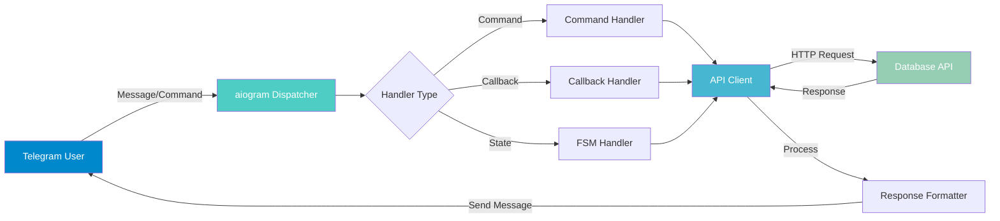
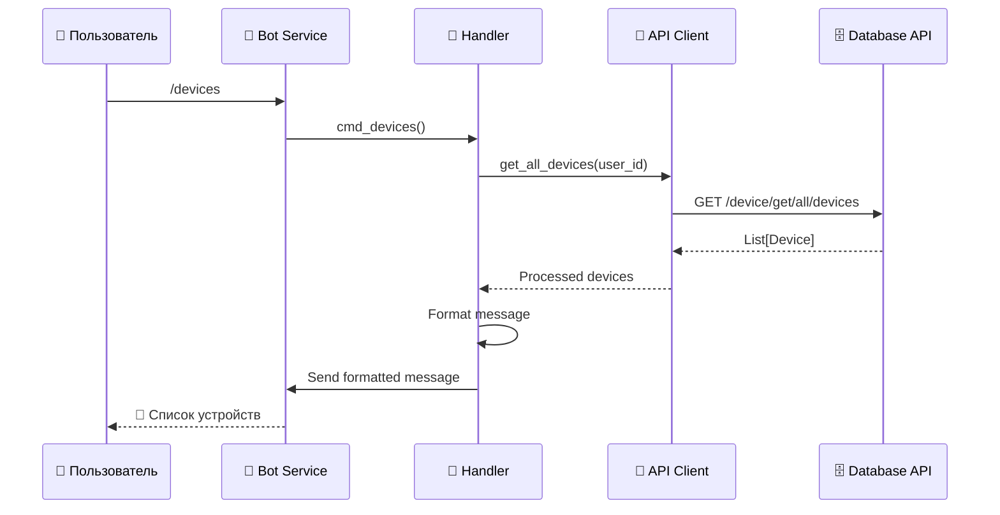
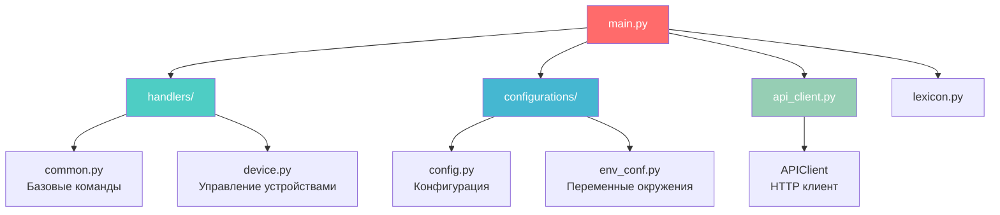
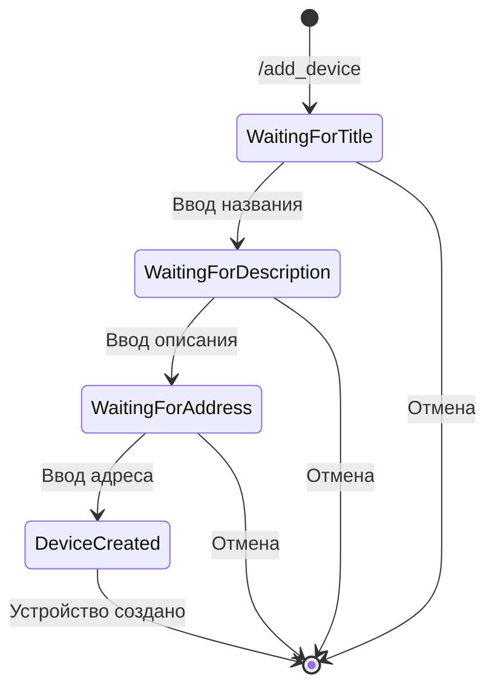
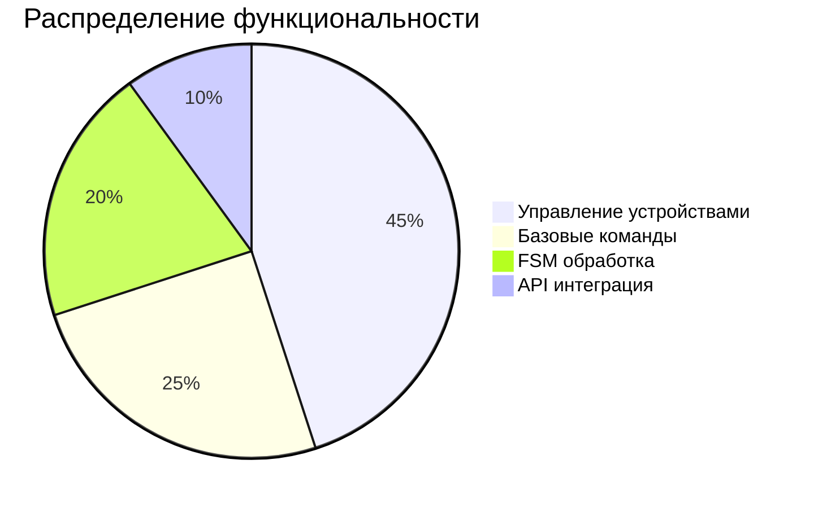

# 🤖 Bot Service - Telegram Bot для управления умным домом

<div align="center">


**Асинхронный Telegram-бот для управления IoT-устройствами**

[📖 Документация](#документация) • [🚀 Быстрый старт](#быстрый-старт) • [📋 Команды](#команды)

</div>

---

## 📋 Содержание

- [Описание](#описание)
- [Архитектура](#архитектура)
- [Функциональность](#функциональность)
- [Быстрый старт](#быстрый-старт)
- [Команды](#команды)
- [Конфигурация](#конфигурация)
- [Разработка](#разработка)

---

## 🎯 Описание

Bot Service — это асинхронный Telegram-бот, построенный на базе фреймворка **aiogram 3.x**. Сервис предоставляет пользователям удобный интерфейс для управления IoT-устройствами через Telegram.

### Основные возможности

- ✅ Автоматическая регистрация новых пользователей
- ✅ Управление устройствами (добавление, просмотр, удаление)
- ✅ Управление состоянием устройств (включение/выключение)
- ✅ Интерактивное меню с кнопками
- ✅ Валидация данных пользователя
- ✅ Обработка ошибок и логирование

---

## 🏗️ Архитектура

### Схема работы бота



### Поток обработки команды



### Структура модулей



---

## ⚙️ Функциональность

### Команды бота

| Команда | Описание | Пример |
|---------|----------|--------|
| `/start` | Начать работу с ботом, регистрация | `/start` |
| `/help` | Показать справку по командам | `/help` |
| `/devices` | Показать все устройства пользователя | `/devices` |
| `/add_device` | Добавить новое устройство | `/add_device` |
| `/menu` | Показать главное меню | `/menu` |

### Интерактивные функции

- **Главное меню** — быстрый доступ к основным функциям
- **Список устройств** — просмотр всех устройств с кнопками управления
- **Добавление устройства** — пошаговый процесс через FSM (Finite State Machine)
- **Управление устройством** — включение/выключение, удаление

### Процесс добавления устройства



---

## 🚀 Быстрый старт

### Предварительные требования

- Python 3.10+
- Telegram Bot Token (получить у [@BotFather](https://t.me/BotFather))
- Запущенный Database API Service

### Установка

1. **Установите зависимости:**
```bash
cd Bot
pip install -r requirements.txt
```

2. **Настройте переменные окружения:**

Создайте файл `.env` или установите переменные окружения:

```env
BOT_TOKEN=your_telegram_bot_token
DATABASE_API_URL=http://localhost:8000
```

3. **Запустите бота:**
```bash
python main.py
```

### Запуск через Docker

```bash
# Из корневой директории проекта
docker compose up bot -d
```

---

## 📋 Команды

### `/start`

Регистрация нового пользователя или приветствие существующего.

**Поведение:**
- Новый пользователь → автоматическая регистрация
- Существующий активный пользователь → приветствие
- Заблокированный пользователь → сообщение о блокировке

### `/devices`

Показывает список всех устройств пользователя.

**Формат вывода:**
```
📱 Ваши устройства

Название устройства
ID: 1
Описание: Описание устройства
Статус: ✅ Включено
Адрес: 192.168.1.100
────────────────────
```

### `/add_device`

Запускает процесс добавления нового устройства через FSM.

**Шаги:**
1. Ввод названия устройства
2. Ввод описания (опционально)
3. Ввод адреса устройства

### `/help`

Показывает справку по всем доступным командам.

### `/menu`

Отображает главное меню с кнопками для быстрого доступа.

---

## ⚙️ Конфигурация

### Структура конфигурации

```python
class BotConfig:
    token: str                    # Telegram Bot Token
    device_control_url: str       # URL для управления устройствами (опционально)

class Config:
    bot: BotConfig
```

### Переменные окружения

| Переменная | Описание | Обязательная |
|------------|----------|--------------|
| `BOT_TOKEN` | Токен Telegram-бота | ✅ Да |
| `DATABASE_API_URL` | URL Database API Service | ✅ Да |
| `DEVICE_CONTROL_URL` | URL для управления устройствами | ❌ Нет |

---

## 🔧 Разработка

### Структура проекта

```
Bot/
├── handlers/              # Обработчики команд и callback'ов
│   ├── __init__.py       # Регистрация всех handlers
│   ├── common.py         # Базовые команды (/start, /help, /menu)
│   └── device.py         # Управление устройствами
├── configurations/        # Конфигурация
│   ├── __init__.py
│   ├── config.py         # Основная конфигурация
│   └── env_conf.py       # Загрузка переменных окружения
├── log/                  # Логирование
│   ├── __init__.py
│   └── config.py         # Настройка логирования
├── api_client.py         # HTTP клиент для Database API
├── lexicon.py            # Все текстовые сообщения бота
├── main.py              # Точка входа
├── requirements.txt     # Зависимости
└── Dockerfile           # Docker образ
```

### Добавление новой команды

1. **Создайте обработчик в соответствующем файле:**
```python
# handlers/common.py
async def cmd_new_command(message: Message):
    await message.answer("Новая команда!")
```

2. **Зарегистрируйте обработчик:**
```python
# handlers/__init__.py
def register_handlers(dp: Dispatcher):
    # ...
    dp.message.register(cmd_new_command, Command("new_command"))
```

3. **Добавьте описание в lexicon.py:**
```python
LEXICON: Final[dict[str, str]] = {
    # ...
    "new_command_text": "Описание новой команды"
}
```

### Логирование

Бот использует **Loguru** для логирования. Логи сохраняются в:
- `logs/app.log` — общие логи
- `logs/app_errors.log` — ошибки

### Тестирование

Для тестирования бота локально:

1. Запустите Database API Service
2. Используйте ngrok или локальный туннель для webhook (если используется)
3. Или используйте polling режим (по умолчанию)

---

## 📊 Статистика



---

## 🔍 Примеры использования

### Пример: Добавление устройства

```
Пользователь: /add_device
Бот: ➕ Добавление нового устройства
     Введите название устройства:

Пользователь: Умная лампа
Бот: Введите описание устройства:

Пользователь: Лампа в гостиной
Бот: Введите адрес устройства:

Пользователь: 192.168.1.50
Бот: ✅ Устройство "Умная лампа" успешно добавлено!
     ID: 1
     Адрес: 192.168.1.50
```

### Пример: Просмотр устройств

```
Пользователь: /devices
Бот: 📱 Ваши устройства

     Умная лампа
     ID: 1
     Описание: Лампа в гостиной
     Статус: ✅ Включено
     Адрес: 192.168.1.50
     ────────────────────
     
     [Кнопки управления]
```

---

## 🐛 Отладка

### Частые проблемы

1. **Бот не отвечает:**
   - Проверьте токен бота
   - Убедитесь, что Database API запущен
   - Проверьте логи в `logs/app_errors.log`

2. **Ошибки при создании устройства:**
   - Проверьте формат адреса
   - Убедитесь, что пользователь зарегистрирован
   - Проверьте подключение к Database API

3. **Проблемы с FSM:**
   - Убедитесь, что состояние очищается после завершения
   - Проверьте обработку отмены операций

---

## 📚 Дополнительные ресурсы

- [aiogram документация](https://docs.aiogram.dev/)
- [Telegram Bot API](https://core.telegram.org/bots/api)
- [Основной README проекта](../README.md)

---

<div align="center">

**Сделано с ❤️ для удобного управления умным домом**

</div>

