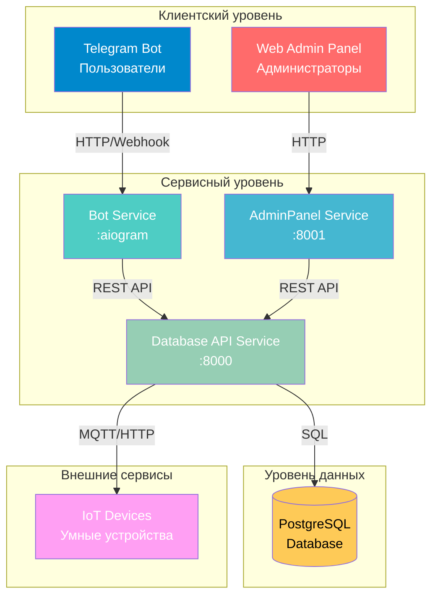
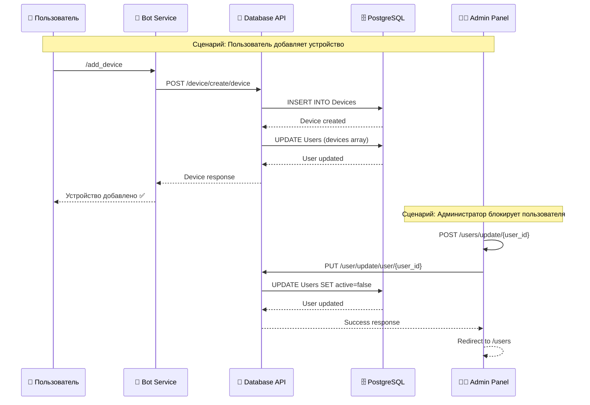
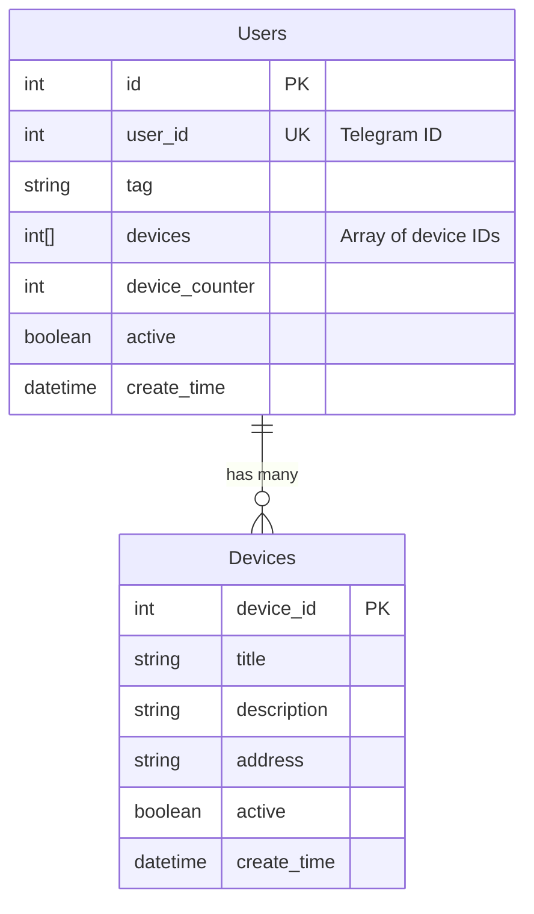
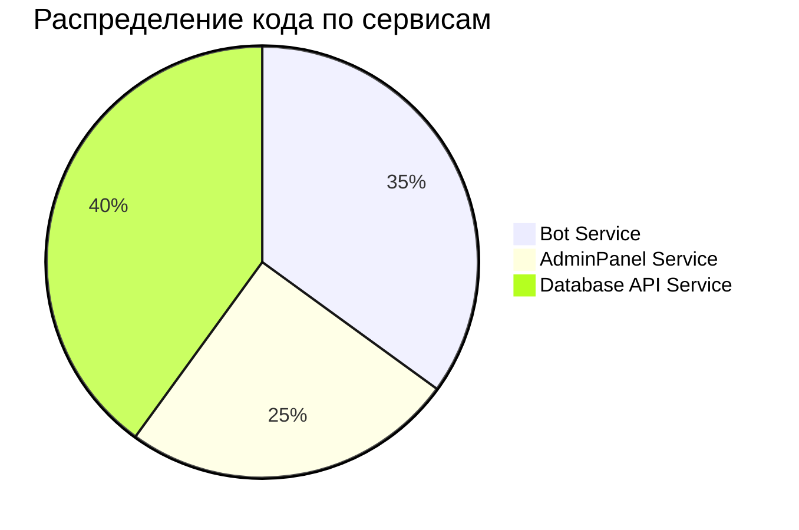

# 🏠 Система управления умным домом (Smart Home Management System)

<div align="center">


**Современная микросервисная архитектура для управления IoT-устройствами через Telegram-бота и веб-панель администратора**

[📖 Документация](#документация) • [🚀 Быстрый старт](#быстрый-старт) • [🏗️ Архитектура](#архитектура) • [📦 Сервисы](#сервисы)

</div>

---

## 📋 Содержание

- [О проекте](#о-проекте)
- [Основные возможности](#основные-возможности)
- [Архитектура системы](#архитектура-системы)
- [Технологический стек](#технологический-стек)
- [Быстрый старт](#быстрый-старт)
- [Сервисы](#сервисы)
- [Разработка](#разработка)
- [Документация](#документация)

---

## 🎯 О проекте

Система управления умным домом — это комплексное решение для централизованного управления IoT-устройствами. Проект реализован на основе микросервисной архитектуры и предоставляет два основных интерфейса взаимодействия:

- **Telegram-бот** — удобный интерфейс для конечных пользователей
- **Веб-панель администратора** — полнофункциональная панель управления для администраторов системы

### Основные возможности

✨ **Для пользователей (Telegram-бот):**
- 📱 Регистрация и авторизация через Telegram
- 🔌 Добавление и управление IoT-устройствами
- 🎛️ Управление состоянием устройств (включение/выключение)
- 📊 Просмотр списка всех устройств
- 🔍 Детальная информация об устройствах

✨ **Для администраторов (Web-панель):**
- 👥 Управление пользователями системы
- 🚫 Блокировка/разблокировка пользователей
- 📈 Просмотр статистики и информации о пользователях
- 🔐 Безопасная аутентификация

---

## 🏗️ Архитектура системы

### Общая схема архитектуры



### Диаграмма взаимодействия сервисов



### Схема базы данных



---

## 🛠️ Технологический стек

### Backend
- **Python 3.10+** — основной язык программирования
- **FastAPI** — современный веб-фреймворк для API
- **aiogram 3.x** — асинхронный фреймворк для Telegram-ботов
- **SQLAlchemy** — ORM для работы с базой данных
- **Pydantic** — валидация данных

### База данных
- **PostgreSQL 13** — реляционная база данных

### Инфраструктура
- **Docker & Docker Compose** — контейнеризация и оркестрация
- **Uvicorn** — ASGI-сервер

### Логирование
- **Loguru** — продвинутое логирование

---

## 🚀 Быстрый старт

### Предварительные требования

- Docker и Docker Compose установлены
- Git для клонирования репозитория

### Установка и запуск

1. **Клонируйте репозиторий:**
```bash
git clone https://github.com/reneget/IoT_Butler/tree/main
cd IoT_Butler
```

2. **Настройте переменные окружения:**
   
   Создайте файлы `.env` в каждой директории сервиса (Bot, AdminPanel, DataBase) с необходимыми настройками.

3. **Запустите все сервисы:**
```bash
docker compose up --build -d
```

4. **Проверьте статус сервисов:**
```bash
docker compose ps
```

### Доступ к сервисам

После запуска сервисы будут доступны по следующим адресам:

- **Database API**: http://localhost:8000
- **Admin Panel**: http://localhost:8001
- **Telegram Bot**: работает через Telegram API

### Остановка сервисов

```bash
docker compose down
```

Для полной очистки (включая volumes):
```bash
docker compose down -v
```

---

## 📦 Сервисы

Проект состоит из трех основных микросервисов:

### 1. 🤖 Bot Service
Telegram-бот для управления устройствами пользователями.

📖 [Подробная документация →](./Bot/README.md)

**Основные функции:**
- Регистрация пользователей
- Управление устройствами
- Интерактивное меню

### 2. 👨‍💼 AdminPanel Service
Веб-панель для администраторов системы.

📖 [Подробная документация →](./AdminPanel/README.md)

**Основные функции:**
- Управление пользователями
- Блокировка/разблокировка аккаунтов
- Просмотр статистики

### 3. 📡 Database API Service
REST API для работы с базой данных.

📖 [Подробная документация →](./DataBase/README.md)

**Основные функции:**
- CRUD операции для пользователей
- CRUD операции для устройств
- Валидация данных

---

## 🔧 Разработка

### Структура проекта

```
IoT_Butler/
├── Bot/                    # Telegram-бот сервис
│   ├── handlers/          # Обработчики команд и callback'ов
│   ├── configurations/     # Конфигурация
│   ├── main.py            # Точка входа
│   └── Dockerfile
├── AdminPanel/            # Веб-панель администратора
│   ├── routes/            # Маршруты FastAPI
│   ├── templates/         # HTML шаблоны
│   ├── configurations/    # Конфигурация
│   ├── main.py           # Точка входа
│   └── Dockerfile
├── DataBase/             # API сервис
│   ├── API/              # REST API endpoints
│   ├── DataBase/         # Модели и репозитории
│   ├── configurations/   # Конфигурация
│   ├── main.py          # Точка входа
│   └── Dockerfile
├── img/                  # Изображения для документации
├── logs/                 # Логи приложения
├── docker-compose.yml    # Конфигурация Docker Compose
└── README.md            # Этот файл
```

### Локальная разработка

Для разработки без Docker:

1. Установите зависимости:
```bash
cd Bot && pip install -r requirements.txt
cd ../AdminPanel && pip install -r requirements.txt
cd ../DataBase && pip install -r requirements.txt
```

2. Настройте PostgreSQL локально или используйте Docker только для БД:
```bash
docker compose up postgres -d
```

3. Запустите сервисы отдельно:
```bash
# Terminal 1
cd Bot && python main.py

# Terminal 2
cd AdminPanel && python main.py

# Terminal 3
cd DataBase && python main.py
```

---
### API Документация

После запуска сервисов доступна автоматическая документация:

- **Database API Swagger**: http://localhost:8000/docs
- **Admin Panel**: http://localhost:8001

---

## 📊 Статистика проекта



---

## 🤝 Вклад в проект

Мы приветствуем вклад в развитие проекта! Пожалуйста:

1. Создайте форк проекта
2. Создайте ветку для новой функции (`git checkout -b feature/AmazingFeature`)
3. Зафиксируйте изменения (`git commit -m 'Add some AmazingFeature'`)
4. Отправьте в ветку (`git push origin feature/AmazingFeature`)
5. Откройте Pull Request

---

## 📝 Лицензия

Этот проект лицензирован под MIT License - см. файл [LICENSE](LICENSE) для деталей.

---

## 👥 Авторы

- **[reneget_](https://github.com/reneget)**

---

<div align="center">

**Сделано с ❤️ для управления умным домом**

⭐ Если проект был полезен, поставьте звезду!

</div>
